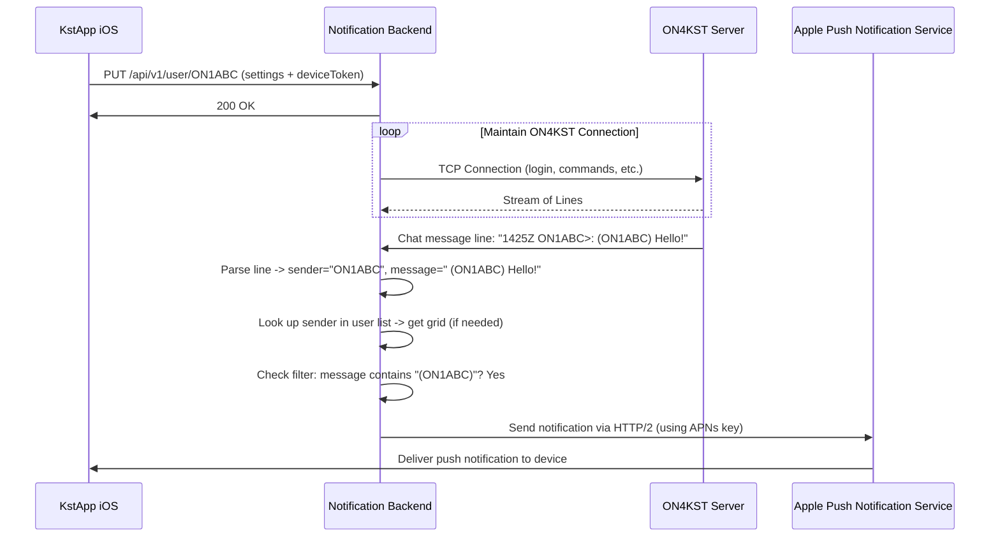

# Backend Design for Push Notifications in KstApp

## Overview
This document describes the design of a backend service that delivers push notifications to the KstApp iOS application when the app is not active (in background or terminated). The backend connects to the ON4KST chat server (www.on4kst.info:23000), filters incoming messages based on user-defined notification criteria, and sends push notifications via either Apple Push Notification service (APNs) or Pushover.net.

## Key Features
- Maintains persistent TCP connections to ON4KST per user (for users who have enabled notifications)
- Logs in to ON4KST using user-provided credentials (username/password)
- Periodically updates user list (via `/sh us` command) to map callsigns to grid squares
- Parses incoming chat messages using the same format as the iOS client
- Implements notification filtering matching the iOS app's behavior:
    * `all`: Notify for every message
    * `myCallsign`: Notify only when message contains the user's callsign in parentheses (case-insensitive)
- Provides a secure HTTP API for the app to synchronize all settings (ON4KST credentials, grid, notification preferences, and push notification tokens)
- Supports two push notification backends:
    1. **APNs (Apple Push Notification service)**: Requires Apple Developer account and APNs key. Users provide device token via the app.
    2. **Pushover.net**: Simple HTTP API. Users provide their Pushover User Key; administrator provides the Pushover Application API Token.
- Designed to run on a Raspberry Pi (or any Node.js-capable device)

## Architecture Overview

```
+-------------------+     HTTPS/WSS     +------------------+
|   KstApp (iOS)    | <--------------> |   Notification   |
|                   |  (Settings Sync) |   Backend Service|
+-------------------+                  +--------+---------+
                                             |
                                   TCP Socket | 
                                   (ON4KST)   |
                                   v          v
                              +------------------+
                              |  ON4KST Server   |
                              | (www.on4kst.info)|
                              +------------------+
```

### Components
1. **Connection Manager**: Manages a TCP connection to `www.on4kst.info:23000` for each user who has enabled notifications. Handles login, command execution, and message reception.
2. **Message Parser**: Processes incoming lines from the TCP connection to:
   - Handle login prompts (`Login:`, `Password:`, `Your choice`)
   - Detect command completion (for commands we send: login, set grid, show users)
   - Identify chat messages using the pattern: `^([0-9]{4})Z (.*)>(.*)$`
3. **User List Manager**: For each connection, periodically executes `/sh us` and parses the response to maintain a mapping from callsign to grid square (and callsign to name).
4. **Notification Filter**: Applies the user's selected filter (`all` or `myCallsign`) to determine if a chat message should trigger a notification.
5. **Push Notification Dispatcher**: Sends notifications via the configured method (APNs or Pushover).
6. **Settings API**: REST endpoint for the app to update user-specific settings (ON4KST username/password/grid, notification enabled/disabled, filter choice, device token for APNs, Pushover user key).

## Detailed Design

### 1. Connection to ON4KST
- The backend maintains a separate TCP connection to `www.on4kst.info:23000` for each user that has enabled notifications in the app.
- Upon establishing a connection for a user, the backend:
    1. Waits for the `Login:` prompt and sends the user's ON4KST username.
    2. Waits for the `Password:` prompt and sends the user's password.
    3. Waits for the `Your choice` prompt and sends the user's selected room index (default: 1 for "50/70 MHz").
    4. If the user provided a grid square, sends `/set qra <GRID>` to set their location.
    5. Starts a repeating timer (every 3 minutes) to send `/sh us` and update the user list.
- The connection is kept alive. If disconnected, the backend attempts to reconnect with exponential backoff.

### 2. Message Parsing
Each line received from the TCP connection is processed as follows:

#### a) Command Response Handling
If we are currently expecting a response to a command we sent (login, set grid, show users, etc.), we look for the command end pattern:
```
^([0-9]{4})Z <OUR_USERNAME> <ROOM_NAME> chat>(.*)$
```
(Note: This is used internally to detect when a command has finished, but we do not use the captured message for notifications.)

#### b) Chat Message Parsing
If the line does not match a command end pattern and we are not in the middle of a command response, we check for a chat message:
```
^([0-9]{4})Z (.*)>(.*)$
```
- **Group 1 (time)**: HHMM in UTC (e.g., "1425" for 14:25 UTC). *Note: The iOS app ignores this and uses the current local time for display; we do the same for notification timestamps.*
- **Group 2 (sender)**: The callsign of the user who sent the message (up to the `>` character).
- **Group 3 (message)**: The message text (everything after the `>`).

Example line: `1425Z ON1ABC>: Hello world!`  
- Sender: `ON1ABC`  
- Message: ` Hello world!` (note the leading space)

### 3. User List Maintenance
To obtain grid squares for senders (needed for potential future features and to match the iOS app's data model), we:
- Send the `/sh us` command every 3 minutes (as per the iOS app).
- Parse each line of the response using the pattern: `^(\\S{3,})\\s{1,}(\\S+)\\s(.*)$`
    - Group 1: Callsign (e.g., "ON1ABC")
    - Group 2: Grid square (e.g., "JO21xx")
    - Group 3: Station comment (ignored for now)
- Store the mapping in memory (or persistent storage) for the duration of the connection.

### 4. Notification Filtering
For each parsed chat message, we check if a notification should be sent for the associated user:

```javascript
if (user.notificationsEnabled) {
  if (user.notificationFilter === 'all') {
    sendNotification(user, message);
  } else if (user.notificationFilter === 'myCallsign') {
    // Check if message contains user's callsign in parentheses (case-insensitive)
    const pattern = new RegExp(`\\(${user.myCallsign.toUpperCase()}\\)`, 'i');
    if (pattern.test(message.message)) {
      sendNotification(user, message);
    }
  }
}
```
Note: `user.myCallsign` is set to the user's ON4KST username (uppercased) upon login, as done in the iOS app.

### 5. Push Notification Options

#### Option A: APNs (Apple Push Notification Service)
**Requirements:**
- Apple Developer Program membership
- APNs authentication key (`.p8` file) or certificate
- Bundle ID of the KstApp iOS app

**Flow:**
1. The iOS app, upon launch, registers for remote notifications with APNs and receives a device token.
2. The app sends this device token to the backend via the Settings API (along with other settings).
3. The backend securely stores the device token associated with the user's ON4KST username.
4. When a notification is triggered, the backend uses the `apn` library (or similar) to send a push notification to APNs:
    - Connects to APNs using the provider's API (HTTP/2) with the APNs key.
    - Sends a JSON payload containing the notification details (title, body, etc.) and the device token.
5. APNs routes the notification to the user's device.

**Advantages:**
- Native iOS appearance (banner, badge, sound)
- No need for users to install a separate app
- Works even if the app is not running (thanks to Apple's push notification service)

**Disadvantages:**
- Requires handling of APNs credentials and certificate/key management
- More complex initial setup

#### Option B: Pushover.net
**Requirements:**
- A Pushover account (for the backend operator to create an application)
- Pushover Application API Token (created on Pushover website)
- For each user: their Pushover User Key (obtained from the Pushover app/website)

**Flow:**
1. The user installs the Pushover client on their iOS device and creates an account.
2. The user retrieves their User Key from the Pushover app or website.
3. The user provides their User Key to the backend via the Settings API (along with other settings).
4. The backend stores the User Key associated with the user's ON4KST username.
5. When a notification is triggered, the backend sends an HTTP POST to `https://api.pushover.net/1/messages.json` with:
    - `token`: <Our Pushover Application API Token>
    - `user`: <User's Pushover User Key>
    - `message`: <Notification message>
    - Optional: `title`, `sound`, `priority`, etc.
6. Pushover forwards the notification to the user's device where the Pushover app is installed.

**Advantages:**
- Extremely simple to set up and use
- No need to handle device tokens or APNs certificates
- Reliable service with good delivery guarantees
- Works on multiple platforms (iOS, Android, desktop)

**Disadvantages:**
- Requires users to install and configure a separate app (Pushover)
- Notification appearance is determined by Pushover (not native iOS style, though customizable)
- Depends on a third-party service (though Pushover is highly reliable)

### 6. Unified Settings Sharing with the Backend
The KstApp iOS application has a single settings screen where the user configures:
- Backend URL (the URL of this notification backend service)
- ON4KST Username
- ON4KST Password
- Grid Square (optional)
- Notification Enabled (toggle)
- Notification Filter (picker: all or myCallsign)
- (Implicitly, for APNs: the app has registered for remote notifications and obtained a device token)
- (For Pushover: the user has installed Pushover and obtained their User Key)

When the user changes any of these settings and has "Sync with Backend" enabled (or auto-sync is configured), the app sends a `PUT` request to:

```
PUT /api/v1/user/:username
```
**Where**: `:username` is the user's ON4KST username (used to identify the user in the backend).

**Headers:**
- `Content-Type: application/json`
- `Authorization: Bearer <shared_secret>` (optional, for simple authentication; alternatively, use HTTPS and rely on the username in the path for basic scenarios)

**Body:**
```json
{
  "on4kstUsername": "string",      // ON4KST username (should match :username in URL)
  "on4kstPassword": "string",      // ON4KST password
  "gridSquare": "string",          // Optional: Maidenhead grid square (e.g., "FN20rl")
  "notificationsEnabled": boolean,
  "notificationFilter": "all" | "myCallsign",
  "deviceToken": "string",           // Optional: for APNs (iOS device token)
  "pushoverUserKey": "string"        // Optional: for Pushover
}
```

**Notes:**
- The backend stores all these settings (encrypting sensitive data like password and push tokens).
- The backend uses the ON4KST credentials to log in to the ON4KST server.
- The backend uses the notification settings to filter messages.
- The backend uses the push token (device token for APNs or Pushover user key) to send notifications.
- If using APNs, the `deviceToken` is required when notifications are enabled.
- If using Pushover, the `pushoverUserKey` is required when notifications are enabled.
- The backend does not store the Backend URL (the app uses it to know where to send the sync request).

### 7. Security Considerations
- All communication between the app and the backend must be over HTTPS to protect credentials and settings.
- The backend should store sensitive data (ON4KST passwords, device tokens, Pushover keys) encrypted at rest.
- Rate limiting should be applied to the settings endpoint to prevent abuse.
- The backend must validate that the username in the settings request corresponds to the authenticated user (if using authentication) or ensure that the endpoint is not exposed to untrusted networks if using no authentication.

### 8. Data Flow Example (APNs)
1. User opens KstApp, goes to Settings, and enters:
    - Backend URL: `https://mypush.example.com`
    - ON4KST Username: `ON1ABC`
    - ON4KST Password: `********`
    - Grid Square: `FN20rl` (optional)
    - Notification Enabled: ON
    - Notification Filter: `My Callsign Only`
    - (Implicitly, the app has registered for APNs and obtained a device token)
2. User enables "Sync with Backend" (or settings are auto-sync'ed).
3. App sends PUT request to `https://mypush.example.com/api/v1/user/ON1ABC` with:
    ```json
    {
      "on4kstUsername": "ON1ABC",
      "on4kstPassword": "********",
      "gridSquare": "FN20rl",
      "notificationsEnabled": true,
      "notificationFilter": "myCallsign",
      "deviceToken": "abc123def456..."
    }
    ```
4. Backend stores the settings (encrypting password and device token) and associates them with username `ON1ABC`.
5. User backgrounds the app or locks the device.
6. Backend maintains TCP connection to ON4KST for user `ON1ABC`:
    - Logs in with `ON1ABC` and password.
    - Sets grid square (if provided) via `/set qra FN20rl`.
    - Starts periodic `/sh us` updates.
7. ON4KST sends a message: `14:25Z ON1ABC>: (ON1ABC) Hello! FN20rl`
8. Backend parses the message:
    - Sender: `ON1ABC`
    - Message: ` (ON1ABC) Hello!`
    - Looks up grid for `ON1ABC` from user list (not needed for filtering, but stored for completeness).
9. Since filter is `myCallsign`, checks if message contains `(ON1ABC)` (case-insensitive) -> match.
10. Backend triggers a push notification via APNs:
    - Uses its APNs key to authenticate to Apple's push service.
    - Sends notification to device token `abc123def456...` with title "ON4KST Chat" and body `ON1ABC: (ON1ABC) Hello!`.
11. User receives the notification on their iOS device (even if the app is not running).

### 9. Data Flow Example (Pushover)
Same as above, but:
- In step 3, the app sends `pushoverUserKey` instead of `deviceToken`.
- In step 10, the backend sends an HTTP POST to Pushover's API with:
    ```json
    {
      "token": "our_pushover_app_token",
      "user": "user_pushover_user_key",
      "message": "ON1ABC: (ON1ABC) Hello!"
    }
    ```
- Pushover delivers the notification to the user's device where the Pushover app is installed.

### 10. Configuration
The backend is configured via environment variables or a configuration file:
- `PORT`: HTTP server port (default: 3000)
- `NODE_ENV`: development or production
- `ENCRYPTION_KEY`: For encrypting sensitive data at rest (if using persistent storage)
- `APNS_KEY_PATH`: Path to APNs private key (if using APNs)
- `APNS_KEY_ID`: APNs key ID
- `APNS_TEAM_ID`: Apple Team ID
- `APNS_BUNDLE_ID`: Bundle ID of the iOS app (should match KstApp's bundle ID)
- `PUSHOVER_API_TOKEN`: Pushover application API token (if using Pushover)
- `LOG_LEVEL`: debug, info, warn, error

### 11. Diagram of Message Flow (APNs)


### 12. Implementation Considerations
- **Language/Platform**: Node.js (>=14) with TypeScript for maintainability.
- **Dependencies**:
    - `net` (built-in) for TCP connections to ON4KST
    - `express` for the HTTP settings API
    - `apn2` or `apn` (if using APNs)
    - `node-fetch` or `axios` (for Pushover HTTP requests)
    - `redis` or `lowdb` (optional: for persistent storage of user settings and device tokens)
    - `crypto` (built-in) for encrypting sensitive data at rest
- **Scalability**: Each user connection is independent. Horizontal scaling possible with shared state (e.g., Redis) for user session data if needed.
- **Error Handling**: Implement reconnection logic for ON4KST and exponential backoff. Handle push notification service failures with retries and logging.
- **Logging**: Comprehensive logs for debugging connection and notification issues (toggle via `LOG_LEVEL`).

## Conclusion
This backend design provides a reliable way to extend KstApp's notification capabilities to when the app is not active, using either APNs or Pushover. By mirroring the iOS app's message parsing and filtering logic, we ensure consistent behavior. The unified settings approach simplifies the user experience: all credentials and preferences are managed in one place in the app and synchronized with the backend. The design is suitable for deployment on a Raspberry Pi and prioritizes security and ease of use for end-users.

